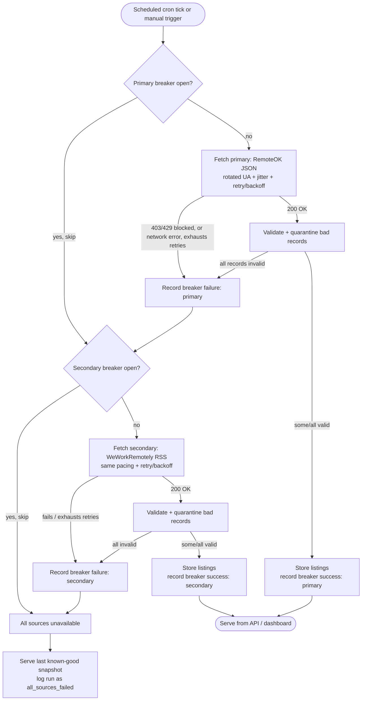

# Design Document: Resilient Job Listing Ingestion

Acdyon Frontend Challenge, Part 1

## What's deployed

A live service that pulls listings from RemoteOK's public `/api` endpoint on a schedule
and on demand, validates and stores them, and serves a small dashboard showing current
listings and the ingestion run history (successes, blocks, fallbacks). RemoteOK is
deliberately the low-risk choice: no login, no account, no ToS to breach. The service
can run continuously in public without putting anyone's account at risk.

The engineering underneath (pacing, identity rotation, retry/backoff, schema validation
with quarantine, fail-soft fallback) is built as if the source were adversarial, because
that's the pattern this task is testing. Everything below describes that pattern and how
it extends to harder sources.

---

## 1. Detection surface

What gives an automated client away, roughly in order of how cheap it is to check:

- No `Accept-Language`, a bare `node-fetch` User-Agent, no `Referer` on
  navigation-style requests. Cheapest signal to check, cheapest to fix.
- Requests fired at exact fixed intervals or with zero latency variance. Humans don't
  poll every 60.000 seconds.
- Headless browser fingerprints: `navigator.webdriver === true`, missing
  plugins/mimeTypes arrays, unusual `navigator.hardwareConcurrency` or WebGL renderer
  strings, JA3 fingerprint not matching any known browser. Relevant for JS-rendered
  login-walled targets like LinkedIn and Indeed; irrelevant to a plain JSON API.
- No mouse movement or scroll variance before a click, sequential pagination that never
  revisits a page, one session pulling thousands of records in a sitting.
- One IP or account making far more requests than a human plausibly would. This is what
  most systems actually key their rate limiting on.

This design covers: header hygiene and UA rotation (`identity.js`), non-uniform pacing
(`identity.jitterDelay`), and explicit handling of 403/429 as distinct from generic
failures (`fetchWithRetry.js`). Block signals back off harder than a transient error.

Not covered: headless fingerprint spoofing and behavioral simulation. Those only matter
against JS-rendered, login-walled targets and aren't applicable here. See section 4.

---

## Flow diagram

---

## 2. Ingestion strategy

Requests rotate through a small User-Agent pool per attempt (`identity.js`). In
production this pairs with rotating egress IPs and per-identity cookie jars so no single
fingerprint accumulates enough volume to get flagged. That infra costs real money and
isn't faked here; see `DECISIONS.md`.

Every request is preceded by a randomized delay, not a fixed interval, so the traffic
pattern doesn't read like a cron job even though it is one.

For authenticated sources the design would hold a pool of sessions with independent
cookie jars and retire a session after N requests or on the first sign of suspicion,
rather than running one session into the ground.

When a source starts blocking: `fetchWithRetry.js` distinguishes 403/429 from transient
failures. Transient errors get normal exponential backoff. Block signals get a harder
backoff and, past a threshold, trip a circuit breaker (`circuitBreaker.js`) that stops
hitting that source entirely. Breaker state is persisted to disk so it survives process
restarts. The pipeline then fails over to the secondary source (WeWorkRemotely RSS), and
if that also fails, serves the last known-good snapshot. The full chain (primary to
secondary to cache) is wired in `ingest.js` and integration-tested in
`test/ingest.test.js`, including a test that asserts the primary fetch is never even
called while its breaker is open.

---

## 3. Resilience

Every stage of a run degrades instead of crashing (`ingest.js`):

| Failure mode | What happens |
|---|---|
| Network error / timeout | Retried with exponential backoff up to `MAX_RETRIES` within a single cycle |
| 403 / 429 | Backed off harder than a generic error within the cycle; repeated blocked cycles trip the circuit breaker for that source |
| Source down across multiple cycles | Breaker trips after 3 consecutive failed cycles; source is skipped for a 10-min cooldown and the pipeline fails over to the secondary |
| Failed half-open probe | Probe failure resets the cooldown timer from that moment, not from the original trip time |
| Both sources down or breaker-open | Falls back to last known-good snapshot, logged as `all_sources_failed` |
| 200 but empty or unparseable | Logged as `empty_response` / `parse_failure`, counted as a breaker failure, last known-good data kept |
| Schema changed overnight | Per-record validation quarantines bad records; if every record fails it's flagged as `schema_drift_suspected` rather than silently overwriting good data |
| Partial bad data | Valid records stored, invalid ones quarantined. Partial success is still success |

The `/api/runs` endpoint and dashboard run log surface all of this in one place so you
can see which cycles succeeded, which source served the data, which sources were blocked
or skipped, and what fallback fired.

---

## 4. Where I'd stop

Every platform in the brief (LinkedIn, Indeed, Naukri, Wellfound) has ToS language
against scraping. Several require you to agree behind a login. My line:

I won't scrape behind a login wall or an authenticated session on a real account. That's
where "getting data out" becomes "using someone's account against the platform's terms,"
and the risk (account ban, potential legal exposure) isn't mine to take on in a
take-home exercise on a platform I don't operate.

I'll pull from sources that are public, unauthenticated, and intended to be
machine-read: public APIs, RSS feeds, or a sandbox I control. That's exactly what this
demo does.

The design enforces this by construction: no login flow, no credential storage, no code
path that authenticates against a real platform account. Extending it to a login-walled
source would be a deliberate separate decision, not something the pipeline does by
default.